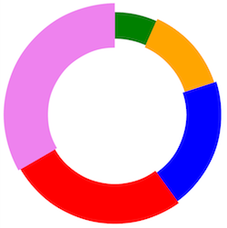

Cronut Factory
==============

This is a simple javascript library to draw cronuts in the web. Depends on
[Raphael](https://github.com/DmitryBaranovskiy/raphael/) which uses the SVG W3C Recommendation and VML as a base for creating graphics.



# API

## CronutFactory.create(options)

CronutFactory.create receives `options` (Object) with the following attributes:

### Parameters

#### container `HTMLElement`
The DOM Element where the cronut will be drawn.

#### width `Number`
Width (in pixels) of the Raphael's paper.

#### height `Number`
Height (in pixels) of the Raphael's paper.

#### radius `Number`
Cronut radius in pixels.

#### stroke_width `Number` (optional)
Default Cronut stroke width in pixels (default: 1).

#### stroke `String` (optional)
Default Cronut stroke color (default: '#FF0000').

#### archs `Array<Object>`
Array of cronut archs. Every arch has the following properties:

* value `Number`: Arch weight.
* css_class `String`: Arch css class that will be added to the path element.
* stroke `String`: Arch stroke color.
* stroke_width `Number`: Arch stroke width.

### Example

```javascript
  CronutFactory.create({
    container: document.getElementById('simple-cronut')
  , width: 500
  , height: 500
  , radius: 200
  , stroke_width: 100
  , stroke: 'violet'
  , archs: [
      {value: 10, css_class: 'path-1', stroke: 'green',  stroke_width: 60}
    , {value: 20, css_class: 'path-2', stroke: 'orange', stroke_width: 70}
    , {value: 30, css_class: 'path-3', stroke: 'blue',   stroke_width: 80}
    , {value: 40, css_class: 'path-4', stroke: 'red',    stroke_width: 90}
    , {value: 50}
    ]
  });
```
